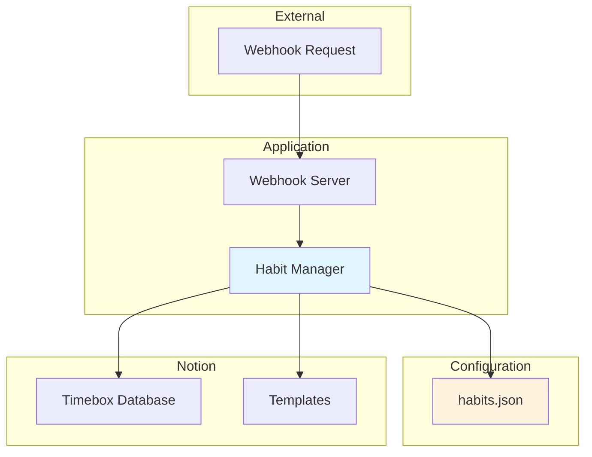

# Design Document

## Overview

The Template-Based Habit Scheduler is a streamlined system that leverages Notion's native template functionality to create habit entries directly in the Timebox database. This design eliminates unnecessary complexity by using a single-component architecture focused on simplicity and reliability.

### Key Design Principles

1. **Simplicity First**: Minimal components, maximum functionality
2. **Notion-Native**: Leverage Notion's built-in features rather than reimplementing them
3. **Configuration-Driven**: All habit scheduling controlled by simple configuration
4. **Stateless Operation**: No complex state management or caching
5. **Direct API Usage**: Minimal abstraction over Notion API

## Architecture



### Simplified Flow

1. **Webhook receives request** → Triggers habit creation
2. **Habit Manager reads configuration** → Determines which habits to create today
3. **For each scheduled habit** → Uses Notion template to create entry
4. **Sets TAG="HABIT" and EXPECTED time** → Returns success metrics

## Components and Interfaces

### 1. Webhook Server

**Responsibility**: HTTP endpoint handling with security validation

```typescript
interface WebhookServer {
  start(): void;
  handleWebhook(request: Request): Promise<Response>;
  validateSecret(request: Request): boolean;
}

interface WebhookResponse {
  success: boolean;
  created: number;
  skipped: number;
  errors: string[];
  executionTime: number;
}

interface WebhookRequest {
  secret: string; // Required security parameter
  timestamp?: number;
}
```

### 2. Habit Manager (Core Component)

**Responsibility**: All habit creation logic

```typescript
interface HabitManager {
  createScheduledHabits(): Promise<HabitCreationResult>;
}

interface HabitCreationResult {
  success: boolean;
  created: HabitEntry[];
  skipped: string[];
  errors: string[];
  executionTime: number;
}

interface HabitEntry {
  id: string;
  title: string; // Internal identifier from habit.name (for logging/tracking, not the Notion page title)
  templateUsed: string;
  timeRange: string;
}
```

**Core Logic**:

```typescript
class HabitManager {
  async createScheduledHabits(): Promise<HabitCreationResult> {
    // 1. Load habit configuration
    const habits = await this.loadHabitConfig();

    // 2. Filter habits due tomorrow
    const dueHabits = habits.filter((h) => this.isDueTomorrow(h));

    // 3. Create each habit using Notion template
    const results = await Promise.all(
      dueHabits.map((habit) => this.createHabitFromTemplate(habit))
    );

    return this.aggregateResults(results);
  }

  private async createHabitFromTemplate(habit: HabitConfig): Promise<CreateResult> {
    // Creates a Notion page using the specified template
    // The page title will be inherited from the template itself
    // Only TAG and EXPECTED properties are set by the system
    return await this.notionClient.pages.create({
      parent: { database_id: this.timeboxDatabaseId },
      template: {
        type: "template_id",
        template_id: habit.templateId,
      },
      properties: {
        TAG: { select: { name: "HABIT" } },
        EXPECTED: {
          date: {
            start: this.calculateStartTime(habit),
            end: this.calculateEndTime(habit),
          },
        },
      },
    });
  }
}
```

## Data Models

### Configuration Model

```typescript
// habits.json - Simple configuration file
interface HabitConfig {
  name: string; // Internal identifier for logging and configuration readability (not used as Notion page title)
  templateId: string;
  frequency: string[]; // ["monday", "tuesday", "friday"] - specific weekdays only
  startTime: string; // "07:00"
  endTime: string; // "08:00"
  enabled: boolean;
}

// Example configuration
const habitsConfig: HabitConfig[] = [
  {
    name: "Morning Exercise", // For logging/config readability only
    templateId: "template-123",
    frequency: ["monday", "tuesday", "wednesday", "thursday", "friday", "saturday", "sunday"], // Every day
    startTime: "07:00",
    endTime: "08:00",
    enabled: true,
  },
  {
    name: "Weekday Standup", // For logging/config readability only
    templateId: "template-456",
    frequency: ["monday", "tuesday", "wednesday", "thursday", "friday"],
    startTime: "09:00",
    endTime: "09:30",
    enabled: true,
  },
  {
    name: "Weekly Review", // For logging/config readability only
    templateId: "template-789",
    frequency: ["sunday"],
    startTime: "19:00",
    endTime: "20:00",
    enabled: true,
  },
  {
    name: "Night Sleep Routine", // For logging/config readability only
    templateId: "template-101",
    frequency: ["monday", "tuesday", "wednesday", "thursday", "friday", "saturday", "sunday"],
    startTime: "23:00",
    endTime: "06:00", // Crosses midnight - ends the next morning
    enabled: true,
  },
];
```

### Environment Configuration

```typescript
interface SystemConfig {
  NOTION_API_KEY: string;
  TIMEBOX_DATABASE_ID: string;
  WEBHOOK_SECRET: string; // Required for security validation
  PORT: number;
  TIMEZONE: string;
}
```

## Security

### Webhook Authentication

```typescript
class WebhookServer {
  private validateSecret(request: Request): boolean {
    const providedSecret = request.body?.secret || request.query?.secret;
    const expectedSecret = process.env.WEBHOOK_SECRET;

    if (!expectedSecret) {
      throw new Error("WEBHOOK_SECRET not configured");
    }

    if (!providedSecret) {
      console.warn("Webhook request missing secret parameter");
      return false;
    }

    return providedSecret === expectedSecret;
  }

  async handleWebhook(request: Request): Promise<Response> {
    // Security validation first
    if (!this.validateSecret(request)) {
      return {
        status: 401,
        body: { error: "Unauthorized: Invalid or missing secret" },
      };
    }

    // Process habit creation
    const result = await this.habitManager.createScheduledHabits();
    return { status: 200, body: result };
  }
}
```

### Security Requirements

1. **Secret Validation**: All webhook requests must include valid secret parameter
2. **Environment Protection**: WEBHOOK_SECRET must be set in environment variables
3. **Request Rejection**: Invalid requests return 401 Unauthorized immediately
4. **No Secret Logging**: Secret values must never appear in logs or error messages

## Time Calculation Logic

### Simple Time Calculation

```typescript
function calculateTimeRange(habit: HabitConfig): { start: string; end: string } {
  const tomorrow = new Date();
  tomorrow.setDate(tomorrow.getDate() + 1);
  const tomorrowDate = tomorrow.toISOString().split("T")[0]; // YYYY-MM-DD
  const start = new Date(`${tomorrowDate}T${habit.startTime}:00`);
  const end = new Date(`${tomorrowDate}T${habit.endTime}:00`);

  return {
    start: start.toISOString(),
    end: end.toISOString(),
  };
}
```

### Cross-Day Time Handling

The system supports habits that span across midnight (e.g., 23:00-06:00). When `endTime` is earlier than `startTime`, the system automatically interprets this as crossing into the next day.

```typescript
function calculateTimeRange(habit: HabitConfig): { start: string; end: string } {
  const tomorrow = new Date();
  tomorrow.setDate(tomorrow.getDate() + 1);
  const tomorrowDate = tomorrow.toISOString().split("T")[0]; // YYYY-MM-DD

  const start = new Date(`${tomorrowDate}T${habit.startTime}:00`);
  let end = new Date(`${tomorrowDate}T${habit.endTime}:00`);

  // If end time is before start time, it means the habit crosses midnight
  // Add one day to the end time
  if (end <= start) {
    end = new Date(end);
    end.setDate(end.getDate() + 1);
  }

  return {
    start: start.toISOString(),
    end: end.toISOString(),
  };
}
```

**Examples:**

- `startTime: "07:00", endTime: "08:00"` → Same day (2024-01-15 07:00 to 2024-01-15 08:00)
- `startTime: "23:00", endTime: "06:00"` → Cross-day (2024-01-15 23:00 to 2024-01-16 06:00)
- `startTime: "22:30", endTime: "01:30"` → Cross-day (2024-01-15 22:30 to 2024-01-16 01:30)

## Scheduling Logic

### Daily Execution Model

The system is designed to be invoked daily via webhook. Each invocation processes only the habits scheduled for the next day.

**Execution Flow:**

1. External automation tool (e.g., cron, GitHub Actions) triggers webhook daily
2. System receives webhook request and calculates the next day's date
3. System filters habits based on the next day's weekday
4. System creates only the habits scheduled for the next day
5. System returns metrics for the execution

**Example:**

- Monday webhook → Creates habits with `frequency: ["tuesday"]` (for Tuesday)
- Tuesday webhook → Creates habits with `frequency: ["wednesday"]` (for Wednesday)
- A habit with `frequency: ["monday", "wednesday", "friday"]` will be created on Sunday, Tuesday, and Thursday (one day before each scheduled day)

### Frequency Patterns

```typescript
function isDueToday(habit: HabitConfig, today: Date): boolean {
  if (!habit.enabled) return false;

  const tomorrow = new Date(today);
  tomorrow.setDate(tomorrow.getDate() + 1);
  const dayName = tomorrow.toLocaleDateString("en", { weekday: "lowercase" });

  // Check if tomorrow is in the frequency array
  return habit.frequency.includes(dayName);
}
```

**Supported Patterns:**

- Daily: `["monday", "tuesday", "wednesday", "thursday", "friday", "saturday", "sunday"]`
- Weekdays: `["monday", "tuesday", "wednesday", "thursday", "friday"]`
- Weekends: `["saturday", "sunday"]`
- Custom: Any combination of weekdays (e.g., `["monday", "wednesday", "friday"]`)

Note: The system creates habits for the next day, so a webhook triggered on Sunday will create habits scheduled for Monday.

## Correctness Properties

_A property is a characteristic o
r behavior that should hold true across all valid executions of a system—essentially, a formal statement about what the system should do. Properties serve as the bridge between human-readable specifications and machine-verifiable correctness guarantees._

### Core Properties (Simplified)

**Property 1: Habit Creation Accuracy**
_For any_ habit configuration and date combination, the system should create a habit entry if and only if the habit is scheduled for that date according to its frequency pattern
**Validates: Requirements 2.2, 2.4**

**Property 2: Template Application Consistency**
_For any_ habit creation, the system should use the specified template and correctly set both TAG="HABIT" and EXPECTED properties with calculated time ranges
**Validates: Requirements 3.1, 3.2, 3.3**

**Property 3: Time Calculation Reliability**
_For any_ time slot configuration (including cross-midnight times like 23:00-06:00), the system should produce valid start and end times where end is always after start, properly formatted for Notion
**Validates: Requirements 4.1, 4.3, 4.4**

**Property 4: Configuration Processing**
_For any_ valid habit configuration file, the system should correctly parse and apply all enabled habits according to their frequency patterns
**Validates: Requirements 7.1, 7.3**

**Property 5: Error Handling Robustness**
_For any_ error condition (API failure, invalid config, etc.), the system should log the error and continue processing other habits without complete failure
**Validates: Requirements 6.1, 6.3**

**Property 6: Webhook Response Consistency**
_For any_ webhook request, the system should return a properly formatted response with accurate metrics about created, skipped, and failed habits
**Validates: Requirements 5.3, 5.4, 8.4**

## Error Handling

### Simple Error Strategy

```typescript
interface ErrorResult {
  success: boolean;
  error?: string;
  canContinue: boolean;
}

class HabitManager {
  async createScheduledHabits(): Promise<HabitCreationResult> {
    const results: CreateResult[] = [];
    const errors: string[] = [];

    try {
      const habits = await this.loadHabitConfig();

      for (const habit of habits) {
        try {
          if (this.isDueToday(habit)) {
            const result = await this.createHabitFromTemplate(habit);
            results.push(result);
          }
        } catch (error) {
          // Log error but continue with other habits
          console.error(`Failed to create habit ${habit.name}:`, error);
          errors.push(`${habit.name}: ${error.message}`);
        }
      }
    } catch (error) {
      // Configuration loading failed
      console.error("Failed to load habit configuration:", error);
      return {
        success: false,
        created: [],
        skipped: [],
        errors: [error.message],
        executionTime: 0,
      };
    }

    return {
      success: errors.length === 0,
      created: results.filter((r) => r.success),
      skipped: results.filter((r) => !r.success).map((r) => r.habitName),
      errors,
      executionTime: Date.now() - startTime,
    };
  }
}
```

## Testing Strategy

### Property-Based Testing with fast-check

```typescript
import fc from "fast-check";

describe("Habit Scheduling Properties", () => {
  it("Property 1: Habit Creation Accuracy", () => {
    fc.assert(
      fc.property(
        fc.record({
          name: fc.string(),
          templateId: fc.uuid(),
          frequency: fc.array(
            fc.constantFrom(
              "monday",
              "tuesday",
              "wednesday",
              "thursday",
              "friday",
              "saturday",
              "sunday"
            ),
            { minLength: 1 }
          ),
          timeSlot: fc.constantFrom("morning", "afternoon", "evening"),
          enabled: fc.boolean(),
        }),
        fc.date(),
        async (habitConfig, date) => {
          const shouldCreate = isDueToday(habitConfig, date);
          const result = await habitManager.processHabit(habitConfig, date);

          if (habitConfig.enabled && shouldCreate) {
            expect(result.created).toBe(true);
          } else {
            expect(result.created).toBe(false);
          }
        }
      ),
      { numRuns: 100 }
    );
  });

  it("Property 2: Template Application Consistency", () => {
    fc.assert(
      fc.property(
        fc.record({
          name: fc.string(),
          templateId: fc.uuid(),
          frequency: fc.array(
            fc.constantFrom(
              "monday",
              "tuesday",
              "wednesday",
              "thursday",
              "friday",
              "saturday",
              "sunday"
            ),
            { minLength: 1 }
          ),
          timeSlot: fc.constantFrom("morning", "afternoon", "evening"),
          enabled: fc.constant(true),
        }),
        async (habitConfig) => {
          const result = await habitManager.createHabitFromTemplate(habitConfig);

          expect(result.properties.TAG.select.name).toBe("HABIT");
          expect(result.properties.EXPECTED.date.start).toBeDefined();
          expect(result.properties.EXPECTED.date.end).toBeDefined();
          expect(result.templateUsed).toBe(habitConfig.templateId);
        }
      ),
      { numRuns: 100 }
    );
  });
});
```

### Unit Testing Focus

- **Configuration Loading**: Test various config file formats
- **Time Calculations**: Test all time slot combinations
- **Frequency Logic**: Test all frequency patterns with edge cases
- **Error Scenarios**: Test API failures, invalid configs, network issues
- **Webhook Integration**: Test request/response handling

### Integration Testing

- **End-to-End Flow**: Webhook → Habit Creation → Notion API
- **Real Notion API**: Test with actual Notion database and templates
- **Configuration Scenarios**: Test with various habit configurations
- **Error Recovery**: Test system behavior during failures

## Implementation Notes

### File Structure

```text
src/
├── main.ts                 # Application entry point
├── webhook-server.ts       # HTTP server
├── habit-manager.ts        # Core logic
├── notion-client.ts        # Notion API wrapper
├── config/
│   ├── habits.json        # Habit configurations
│   └── system.ts          # Environment config
└── utils/
    ├── time.ts            # Time calculation utilities
    └── logger.ts          # Simple logging
```

### Dependencies

```json
{
  "dependencies": {
    "@notionhq/client": "^4.0.2",
    "express": "^4.18.2"
  },
  "devDependencies": {
    "fast-check": "^3.15.0",
    "jest": "^29.7.0"
  }
}
```

### Environment Variables

```bash
NOTION_API_KEY=secret_xxx
TIMEBOX_DATABASE_ID=database_id_xxx
WEBHOOK_SECRET=your_secure_secret_here  # Required for webhook authentication
PORT=8080
TIMEZONE=Asia/Tokyo
```

### Security Considerations

- **WEBHOOK_SECRET**: Must be a strong, randomly generated secret shared between the webhook caller and this application
- **Request Validation**: All incoming webhook requests must include the secret parameter (in body or query string)
- **Error Handling**: Security failures return 401 status without revealing system details
- **Environment Security**: All secrets must be stored in environment variables, never in code

This simplified design eliminates unnecessary complexity while maintaining all required functionality. The system is easier to understand, test, and maintain.
