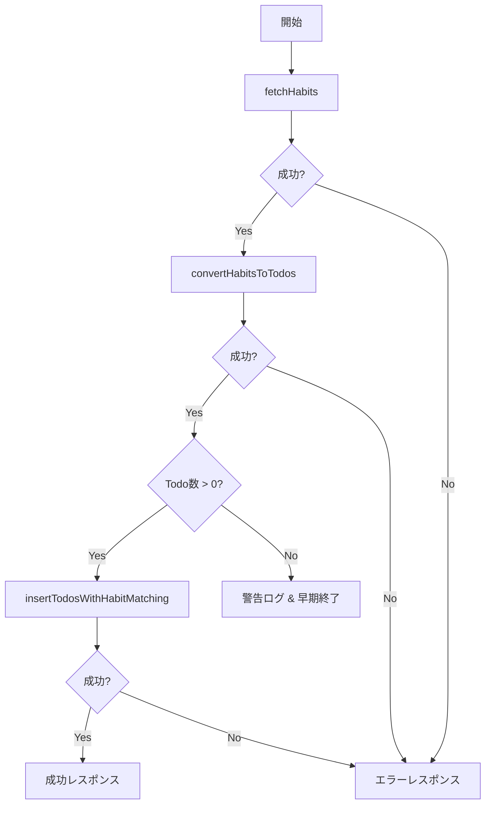

# Orchestration Service

## 📋 概要

OrchestrationServiceは、複数のドメイン機能を統合し、エンドツーエンドのビジネスプロセスを管理する責任を持ちます。

## 🏗️ アーキテクチャ

```text
┌─────────────────────────────────────────────┐
│       OrchestrationService                   │
│  (複数ドメインの統合管理)                      │
│                                             │
│  executeHabitToTodoFlow()                   │
│    │                                        │
│    ├─► 1. fetchHabits()                    │
│    │      (Fetch Domain)                   │
│    │                                        │
│    ├─► 2. convertHabitsToTodos()          │
│    │      (Convert Domain)                 │
│    │                                        │
│    └─► 3. insertTodosWithHabitMatching()  │
│           (Insert Domain)                  │
│                                             │
└─────────────────────────────────────────────┘
```

## 🎯 責任

### 1. **ワークフローの統合**

複数のドメイン機能を適切な順序で実行：

- Habits取得 → Todo変換 → Todos挿入

### 2. **エラーハンドリング**

各ステップでのエラーを統一的に処理：

```typescript
try {
  const result = await someDomainOperation();
  if (!result.success) {
    throw new OrchestrationError('処理失敗', ERROR_CODES.XXX);
  }
} catch (error) {
  // エラーログと統一レスポンス
}
```

### 3. **実行時間の測定**

パフォーマンスモニタリング：

```typescript
const startTime = Date.now();
// ... 処理 ...
const executionTime = Date.now() - startTime;
```

### 4. **ログ出力**

各ステップでの進捗とメトリクスをログ：

```typescript
this.logger.info('習慣→Todo変換フロー開始');
this.logger.info('習慣データ取得完了', { habitCount });
this.logger.info('変換完了', { todoCount });
```

## 📊 処理フロー

### executeHabitToTodoFlow()



### ステップ詳細

#### 1. Habits取得

```typescript
const habitsResult = await fetchHabits();
if (!habitsResult.success || !habitsResult.data) {
  throw new OrchestrationError(
    '習慣データの取得に失敗しました',
    ERROR_CODES.FETCH_ERROR
  );
}
```

#### 2. Todo変換

```typescript
const todosResult = await convertHabitsToTodos(habitsResult.data);
if (!todosResult.success || !todosResult.data) {
  throw new OrchestrationError(
    '変換に失敗しました',
    ERROR_CODES.CONVERSION_ERROR
  );
}
```

#### 3. Todos挿入

```typescript
const insertResult = await insertTodosWithHabitMatching(
  todosResult.data,
  habitsResult.data
);
if (!insertResult.success || !insertResult.data) {
  throw new OrchestrationError(
    'Todoの挿入に失敗しました',
    ERROR_CODES.INSERT_ERROR
  );
}
```

## 📤 レスポンス形式

### OrchestrationResult

```typescript
interface OrchestrationResult {
  success: boolean;
  habitCount?: number;
  todoCount?: number;
  linkedCount?: number;
  error?: string;
  executionTime: number;
}
```

### 成功時

```json
{
  "success": true,
  "habitCount": 10,
  "todoCount": 15,
  "linkedCount": 15,
  "executionTime": 2500
}
```

### エラー時

```json
{
  "success": false,
  "error": "習慣データの取得に失敗しました",
  "executionTime": 1200
}
```

### Todo数が0の場合

```json
{
  "success": true,
  "habitCount": 5,
  "todoCount": 0,
  "linkedCount": 0,
  "executionTime": 800
}
```

## 🚨 エラーハンドリング

### OrchestrationError

カスタムエラークラスで構造化されたエラー情報を提供：

```typescript
export class OrchestrationError extends AppError {
  constructor(
    message: string,
    code: string,
    details?: Record<string, unknown>
  ) {
    super(message, code, details);
    this.name = 'OrchestrationError';
  }
}
```

### エラーコード

- `FETCH_ERROR`: Habits取得エラー
- `CONVERSION_ERROR`: 変換エラー
- `INSERT_ERROR`: 挿入エラー

### エラー伝播

各ドメインのエラーを適切にキャッチして変換：

```typescript
catch (error) {
  if (error instanceof OrchestrationError) {
    return {
      success: false,
      error: error.message,
      executionTime,
    };
  }

  this.logger.error('予期しないエラー', error as Error);
  return {
    success: false,
    error: `予期しないエラーが発生しました: ${error}`,
    executionTime,
  };
}
```

## 📝 ログ出力例

### 正常フロー

```text
[INFO] 習慣→Todo変換フロー開始
[INFO] 習慣データ取得完了 { habitCount: 10 }
[INFO] 変換開始 { habitCount: 10 }
[INFO] 変換完了 { success: true, todoCount: 15 }
[INFO] すべての処理が完了しました {
  habitCount: 10,
  todoCount: 15,
  linkedCount: 15,
  executionTime: '2500ms'
}
```

### エラー時

```text
[INFO] 習慣→Todo変換フロー開始
[ERROR] 習慣データの取得に失敗しました { error: 'Database not found' }
```

### Todo数が0の場合

```text
[INFO] 習慣→Todo変換フロー開始
[INFO] 習慣データ取得完了 { habitCount: 5 }
[INFO] 変換開始 { habitCount: 5 }
[INFO] 変換完了 { success: true, todoCount: 0 }
[WARN] 変換されたTodoが0個です。今日実行すべきHabitがない可能性があります
```

## 🎯 依存性注入

OrchestrationServiceは、`ILogger`のみを依存関係として受け取ります：

```typescript
constructor(private logger: ILogger) {}
```

各ドメインのAPIは、直接インポートして使用：

```typescript
import { fetchHabits } from '../fetch/fetch';
import { convertHabitsToTodos } from '../convert/convert';
import { insertTodosWithHabitMatching } from '../insert/insert';
```

## 📈 パフォーマンス

### 実行時間の内訳

| ステップ   | 平均時間        | 説明                       |
| ---------- | --------------- | -------------------------- |
| Habits取得 | 500-1000ms      | Notion APIからのデータ取得 |
| Todo変換   | 100-300ms       | データ変換とバリデーション |
| Todos挿入  | 1000-3000ms     | Notion APIへの複数挿入     |
| **合計**   | **2000-5000ms** | **全体の処理時間**         |

### 最適化ポイント

1. **並列処理**: 独立した操作は並列実行
2. **キャッシュ**: Repository層でのキャッシュ活用
3. **バッチ処理**: 複数のTodoを効率的に挿入

## 🔄 拡張性

### 新しいフローの追加

新しいワークフローを追加する場合：

```typescript
async executeCustomFlow(): Promise<OrchestrationResult> {
  const startTime = Date.now();

  try {
    this.logger.info('カスタムフロー開始');

    // 1. ドメイン操作1
    const step1Result = await domainOperation1();

    // 2. ドメイン操作2
    const step2Result = await domainOperation2(step1Result.data);

    // 3. 結果を返す
    const executionTime = Date.now() - startTime;
    return {
      success: true,
      executionTime,
    };
  } catch (error) {
    // エラーハンドリング
  }
}
```

### トランザクションサポート（将来的）

複数ドメインをまたぐトランザクションの管理：

```typescript
async executeWithTransaction(): Promise<OrchestrationResult> {
  const transaction = await TransactionManager.begin();

  try {
    await operation1(transaction);
    await operation2(transaction);
    await transaction.commit();
  } catch (error) {
    await transaction.rollback();
    throw error;
  }
}
```

## 🧪 テスト

### 単体テスト

```typescript
describe('OrchestrationService', () => {
  it('should execute full flow successfully', async () => {
    const service = new OrchestrationService(mockLogger);
    const result = await service.executeHabitToTodoFlow();

    expect(result.success).toBe(true);
    expect(result.habitCount).toBeGreaterThan(0);
  });
});
```

### 統合テスト

```typescript
describe('OrchestrationService Integration', () => {
  it('should handle errors gracefully', async () => {
    // モックでエラーを発生させる
    jest.spyOn(fetchModule, 'fetchHabits').mockRejectedValue(new Error());

    const result = await service.executeHabitToTodoFlow();
    expect(result.success).toBe(false);
  });
});
```

## 📚 関連ドキュメント

- [Fetch Domain](../fetch/README.md)
- [Convert Domain](../convert/README.md)
- [Insert Domain](../insert/README.md)
- [WebhookServer](../../presentation/README.md)
- [アーキテクチャガイド](../../.cursorrules/architecture.md)
