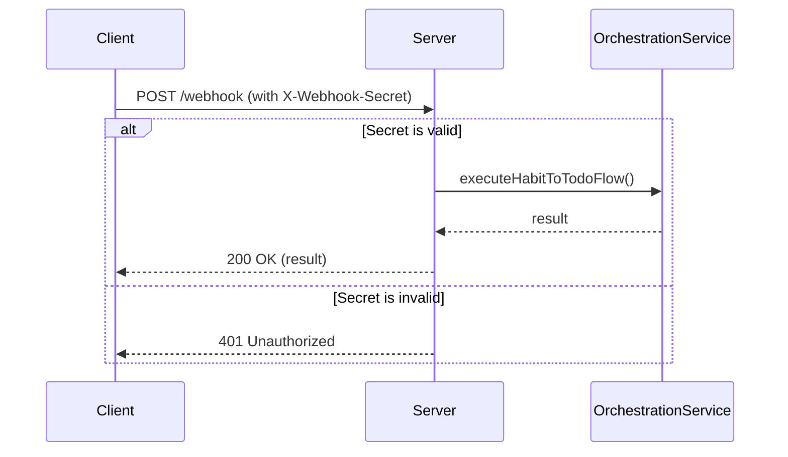

# Presentation Layer - Webhook Server

## 📋 概要

Presentation層は、HTTPリクエストを受け付けてビジネスロジックを呼び出す役割を担います。`WebhookServer`クラスは、Expressベースのサーバーとして実装されています。

## 🏗️ アーキテクチャ

```text
┌─────────────────────────────────────────────┐
│         Presentation Layer                   │
│                                             │
│  ┌──────────────────────────────────────┐  │
│  │         WebhookServer                 │  │
│  │  - Express Application               │  │
│  │  - Middleware Setup                  │  │
│  │  - Route Handling                    │  │
│  │  - Error Handling                    │  │
│  └──────────────────────────────────────┘  │
│                    │                        │
│                    ▼                        │
│  ┌──────────────────────────────────────┐  │
│  │    OrchestrationService              │  │
│  │  (Domain Layer)                      │  │
│  └──────────────────────────────────────┘  │
└─────────────────────────────────────────────┘
```

## 🔧 実装詳細

### WebhookServer クラス

#### 責任

1. **HTTPリクエストの受信**: Expressサーバーとしてリクエストを受信
2. **認証**: Webhookシークレットによる簡易認証
3. **ルーティング**: エンドポイントごとの処理の振り分け
4. **エラーハンドリング**: HTTPエラーレスポンスの統一
5. **ログ出力**: リクエスト/レスポンスのログ記録

#### エンドポイント

| メソッド | パス       | 説明               |
| -------- | ---------- | ------------------ |
| GET      | `/`        | サーバー情報を返す |
| GET      | `/health`  | ヘルスチェック     |
| POST     | `/webhook` | メイン処理を実行   |

### ミドルウェア構成

```typescript
app.use(bodyParser.json()); // JSONパーサー
app.use(requestLogger); // リクエストログ
app.post('/webhook', webhookHandler); // Webhookハンドラー
app.use(notFoundHandler); // 404エラー
app.use(errorHandler); // エラーハンドラー
```

## 🔐 認証フロー



### 認証の実装

```typescript
// ヘッダーから認証情報を取得
const providedSecret = req.headers['x-webhook-secret'];

// 検証
if (providedSecret !== this.webhookSecret) {
  res.status(401).json({
    success: false,
    error: '認証に失敗しました',
  });
  return;
}
```

## 📡 リクエスト/レスポンス形式

### Webhook リクエスト

```http
POST /webhook HTTP/1.1
Host: localhost:8080
Content-Type: application/json
X-Webhook-Secret: your_webhook_secret
```

### 成功レスポンス

```json
{
  "success": true,
  "habitCount": 10,
  "todoCount": 15,
  "linkedCount": 15,
  "executionTime": 2500,
  "responseTime": 2505,
  "timestamp": "2025-10-15T12:00:00.000Z"
}
```

### エラーレスポンス

```json
{
  "success": false,
  "error": "エラーメッセージ",
  "executionTime": 1200,
  "responseTime": 1205,
  "timestamp": "2025-10-15T12:00:00.000Z"
}
```

## 🚨 エラーハンドリング

### エラーの種類

1. **認証エラー** (401): Webhookシークレットが無効
2. **Not Found** (404): エンドポイントが存在しない
3. **サーバーエラー** (500): 処理中にエラーが発生

### エラーハンドラーの実装

```typescript
// 404エラー
app.use((req, res) => {
  res.status(404).json({
    success: false,
    error: 'エンドポイントが見つかりません',
    path: req.path,
  });
});

// 一般的なエラー
app.use((error, req, res, next) => {
  logger.error('サーバーエラー', error);
  res.status(500).json({
    success: false,
    error: '内部サーバーエラーが発生しました',
  });
});
```

## 📊 ログ出力

### リクエストログ

```text
[INFO] リクエスト受信 { method: 'POST', path: '/webhook', ip: '::1' }
```

### 処理ログ

```text
[INFO] Webhook処理開始
[INFO] Webhook処理完了 { success: true, responseTime: '2500ms' }
```

### エラーログ

```text
[ERROR] Webhook処理エラー { error: '...', responseTime: '1200ms' }
```

## 🎯 依存性注入

WebhookServerは、ServiceFactoryを通じて依存関係を取得します：

```typescript
constructor() {
  this.logger = ServiceFactory.getService<ILogger>('logger');
  this.orchestrationService = ServiceFactory.getService<OrchestrationService>(
    'orchestrationService'
  );
}
```

## 🧪 テスト

### 手動テスト

```bash
# ヘルスチェック
curl http://localhost:8080/health

# Webhookの実行
curl -X POST http://localhost:8080/webhook \
  -H "Content-Type: application/json" \
  -H "X-Webhook-Secret: your_webhook_secret"
```

### 統合テスト（将来的）

```typescript
describe('WebhookServer', () => {
  it('should return 200 on health check', async () => {
    const response = await request(app).get('/health');
    expect(response.status).toBe(200);
  });

  it('should require webhook secret', async () => {
    const response = await request(app).post('/webhook');
    expect(response.status).toBe(401);
  });
});
```

## 📈 パフォーマンス

### レスポンスタイム

- **ヘルスチェック**: < 10ms
- **Webhook処理**: 2000-5000ms（Notion APIの応答速度に依存）

### 最適化

1. **非同期処理**: すべてのI/O操作は非同期
2. **キャッシュ**: Repository層でキャッシュを活用
3. **エラーハンドリング**: 早期リターンで無駄な処理を回避

## 🔄 今後の拡張

### 1. 非同期Webhook

長時間処理の場合、即座に202を返してバックグラウンドで処理：

```typescript
res.status(202).json({
  success: true,
  message: '処理を開始しました',
  jobId: 'xxx',
});

// バックグラウンドで処理
processInBackground(jobId);
```

### 2. 認証の強化

JWT、OAuth2など、より堅牢な認証方式：

```typescript
app.use(passport.authenticate('jwt', { session: false }));
```

### 3. レート制限

DoS攻撃の防止：

```typescript
import rateLimit from 'express-rate-limit';

const limiter = rateLimit({
  windowMs: 15 * 60 * 1000, // 15分
  max: 100, // 最大100リクエスト
});

app.use('/webhook', limiter);
```

## 📚 関連ドキュメント

- [OrchestrationService](../domain/orchestration/README.md)
- [アーキテクチャガイド](../../.cursorrules/architecture.md)
- [Express Documentation](https://expressjs.com/)
